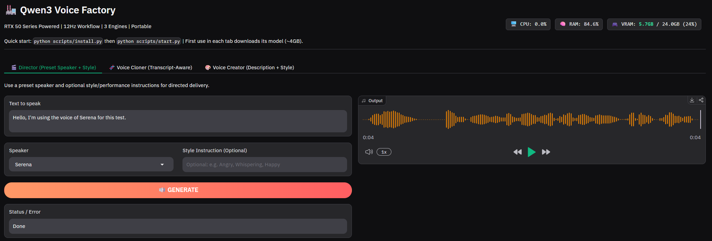

# 🏭 Qwen3 Voice Factory (RTX 50 Series Optimized)

## Overview

A local, portable GUI for [Qwen3-TTS](https://huggingface.co/Qwen/Qwen3-TTS-12Hz-1.7B-CustomVoice), focused on fast testing without complex node graphs (ComfyUI).
Specially optimized for **NVIDIA RTX 50 Series** (CUDA 12.8 / PyTorch Nightly), while still usable on previous generations (3090/4090).



## Quick Start

1. Download this repository as a ZIP file and extract it.
2. Install dependencies and patch support:
   ```powershell
   python scripts/install.py
   ```
3. Start the app:
   ```powershell
   python scripts/start.py
   ```
4. The browser opens at `http://127.0.0.1:7860`.

What `scripts/install.py` does:
- Installs **uv** (if missing).
- Creates a local `.venv` with Python 3.11.
- Installs PyTorch Nightly (Blackwell / RTX 50 support).
- Syncs dependencies from `pyproject.toml`.
- Applies the local 12Hz compatibility patch to `qwen_tts`.

## Features

- **🎬 Director:** Preset speakers with optional style/performance instructions.
- **🧬 Voice Cloner:** 3-10s reference audio cloning with optional transcript-guided high-quality mode.
- **🎨 Voice Creator:** Voice creation from text description + optional performance instruction.
- **📊 Live Hardware Monitor:** Real-time CPU/RAM/VRAM status in the UI.
- **📂 Auto-Save:** Every generation is saved in `outputs_audio/` with a timestamp.
- **Portable workflow:** Everything stays inside the project folder.

## Runtime Behavior

- On first use of a tab, the corresponding model is downloaded from Hugging Face (~4GB each).
- The 12Hz-only `qwen_tts` patch is applied during install and re-checked on each start (idempotent).
- Patch details: [`docs/qwen-tts-patch.md`](docs/qwen-tts-patch.md).

## Models

- `Director`: `Qwen/Qwen3-TTS-12Hz-1.7B-CustomVoice`
- `Voice Cloner`: `Qwen/Qwen3-TTS-12Hz-1.7B-Base`
- `Voice Creator`: `Qwen/Qwen3-TTS-12Hz-1.7B-VoiceDesign`

## Requirements

- Windows 10/11
- NVIDIA GPU (recommended: 12GB+ VRAM)
- Internet connection (required for install and model downloads)

## 🔗 Credits & Acknowledgements

This project is a GUI wrapper built to make the work of the **Qwen Team** easy to use locally.

- **Base models:** [Alibaba Cloud / Qwen Team](https://huggingface.co/Qwen)
- Please support the original work on Hugging Face and GitHub.

## 🤝 Support

This is a free open-source project.
If you want to say thanks, you can support me on **[Spotify](https://open.spotify.com/artist/7EdK2cuIo7xTAacutHs9gv?si=5d3AbCKgR3GemCemctb8FA)**.
